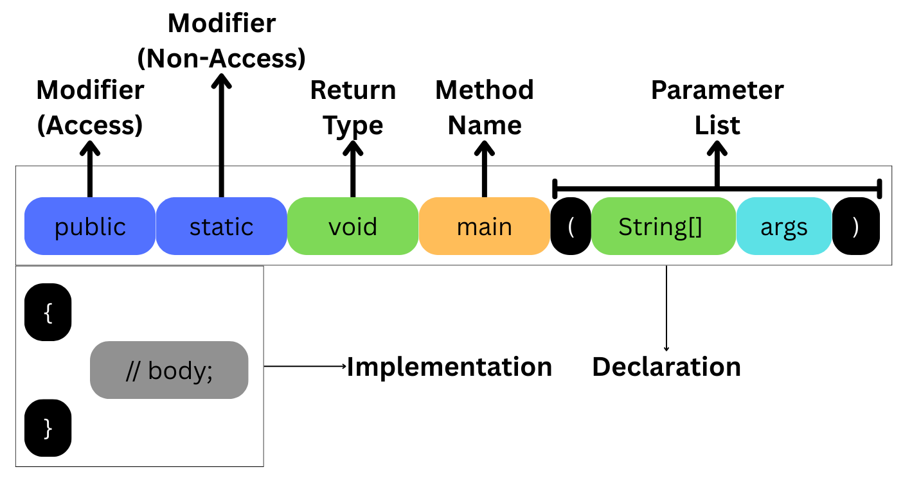

# Object Oriented Programming Concepts

## Class

- `class` is a **blueprint** of the *Object*.

- `class` is a *conceptual* boundary within which we *define* it's **behavior** and **properties**.

- `class` is a **template** using which object(s) can be created and these objects share *common* properties according to the **template**.

## Method

- Also known as **behavior** of `class`.

- These are **blocks of code**, which contain either *business* logic or *application* logic. 

- There are **two** parts of a method:
  
  - *Declaration*
  
  - *Implementation*
  
  

- Naming of **methods** follows **camel case** rule.

- Multiple method **can** be declared in a class, **given that** they differ in *name* or *parameter list* or *both*.

- `main` method is **necessary** to start the *execution* of the code.
  
  - Because, **JVM** starts execution **from** the `main` method.

- We cannot declare a method inside another method, but we can call a method inside another method.

### Types

- There are **two** type:
  
  - *Static*.
  
  - *Non-Static*.

- A method *declared* using **static** keyword, is called **Static Method**.

- A method *declared* *without* using **static** keyword, is called **Non-Static Method**.
  
  ```java
  class TypesOfMethod
  {
      public static void staticMethod()
      {
          System.out.println("This is a Static Method.");
      }
  
      public void nonStaticMethod()
      {
          System.out.println("This is a Non-Static Method.");
      }
  }
  ```

#### Calling of Static and Non-Static Methods.

- A ***static*** method can be called in **3** ways:
  
  - *Directly*.
  
  - By *Class Name* reference.
  
  - By *Object* reference.

- A ***non-static*** method can be called in only **1** way.
  
  - By *Object* reference.
  
  ```java
  class CallingOfMethod
  {
      public static void staticMethod()
      {
          System.out.println("This is a Static Method.");
      }
  
      public void nonStaticMethod()
      {
          System.out.println("This is a Non-Static Method.");
      }
  
      public static void main(String [] args)
      {
          CallingOfMethod ob = new CallingOfMethod();
  
          // Static Method.
          staticMethod(); // -> Directly.
          CallingOfMethod.staticMethod(); // -> By class name ref.
          ob.staticMethod(); // -> By object ref.
          (new CallingOfMethod()).staticMethod(); // -> By object.
  
          // Non-Static Method.
          ob.nonStaticMethod(); // -> By object ref.
          (new CallingOfMethod()).nonStaticMethod(); // -> By object.
      }
  }
  ```

**Any** type of method **can** be called by **Any** other method.

- But, the calling will **always** begin from `main` method.

```java
class StaticNonStatic
{
    public void func()
    {
        System.out.println("Function");
    }

    public void func1()
    {
        (new StaticNonStatic()).func();
        System.out.println("Function1");
    }

    public void func2()
    {
        StaticNonStatic obj = new StaticNonStatic();
        obj.func1();
        System.out.println("Function1");
    }
    public static void main(String [] args)
    {
        StaticNonStatic ob = new StaticNonStatic();
        ob.func2();
    }
}
```

- If we are declaring a method, then it is not mandatory to call it.
  
  - If we are calling a method, them it must have been declared.
  
  - Otherwise, it results in a compilation error.

```java
class CompilationError
{
    public static void func2()
    {
        System.out.println("Hii");
    }
    public static void main(String [] args)
    {
        CompilationError ob = new CompilationError();
        ob.func1(); // Error.
    }
}
```

### Arguments

- **Input** to the method.

- Based on the arguments, methods are divided in to 2 types:
  
  - *No-argument* Method.
  
  - *Parameterized* Method OR *Argumented* Method.

- **No-argument Method**: Whenever a method is declared **without** any variables in the parameter list.

- **Argumented Method**: Whenever a method is declared with **one or more** parameter variables.
  
  - `public static void main(int x) {}` &rarr; Primitive Argument.
  
  - `public static void main(String S) {}` → Non-Primitive Argument.
  
  ```java
  class Arguments
  {
      public static void func(int x, char ch, String S, Arguments ob)
      {
          System.out.println(x + " " + ch + " " + S + " " + ob);
      }
  
      public static void main(Sttring [] args)
      {
          Arguments.func(12, 'q', "Sambit", null); // 12 q Sambit null
          Arguments.func('A', 'q', null, new Arguments()); // 65 q null Arguments@<address_of_object>
          Arguments.func(12, 'q', new String(), null); // 12 q  null
      }
  }
  ```

### Method Signature

- The *combination* of **name** of the method and **type** of the argument.

- A `class` cannot contain more than **one** method, with **same** method signature.
  
  ```java
  class MethodSignature
  {
      public static void func(int x) {}
      //                 func(int)
      public static void func(int x, int y) {}
      //                 func(int, int)
      public static void func1(int x, String S) {}
      //                 func1(int, String)
      public static void main(String [] args) {}
      //                 main(String[])
  }
  ```

### Return Type

- *Defines* the type of data a method is going to return after being called.

- Based on the `return` type there are **three** types of methods:
  
  - `void`
  
  - `primitive`
  
  - `non-primitive`

- If a method has a *return* type other than `void`, then a return statement is **mandatory**.

- In `return` statement, a value is passed, and it's *type* must be either *same as* the `return` type or a value that can be *up-casted*.
  
  ```java
  class ReturnType
  {
      public int func1() { return 12; }
      public String func2() { return "12"; }
      public static void main(String [] args)
      {
          ReturnType ob = new ReturnType();
          int result = ob.func1();
          System.out.println(result);
          System.out.println(ob.func2());
      }
  }
  ```

- There are two ways to display the **return value**:
  
  - *Calling* the method **within** a printing statement.
  
  - *Storing* it in a variable, then **printing** the variable.

- No statement can be written *after* the `return` statement.
  
  - Gives `unreachable statement` error.

### VAR ARG

- A type of *argument*, which can take **any** number of argument as an input, including no arguments.

- **VAR ARG Method**:
  
  - A *method*, which takes a *var arg* as an argument.
  
  ```java
  class VarArgMethod
  {
      public void varArgMethod(int...varArg)
      {
          System.out.println("Hello...");
          for(int i : varArg)
              System.out.println(i);
          for(int i = 0; i < varArg.length; i++)
              System.out.println(varArg[i]);
      }
      public static void main(String [] args)
      {
          VarArgMethod ob = new VarArgMethod();
          ob.varArgMethod();
          ob.varArgMethod(1);
          ob.varArgMethod(1, 2);
          ob.varArgMethod(1, 2, 3);
      }
  }
  ```

- Rules:
  
  - **Exact match** is preferred over *VAR ARG*.
    
    ```java
    class Rule1
    {
        public void func(int...varArg)
        {
            System.out.println("Hello VAR ARG...");
            for(int i : varArg)
                System.out.println(i);
        }
    
        public void func(int Arg)
        {
            System.out.println("Hello Single ARG...");
            System.out.println(i);
        }
    
        public static void main(String [] args)
        {
            (new Rule1()).func(1);
        }
    }
    ```
  
  - **Up-cast match** is preferred over *VAR ARG*.
    
    - **Up-casting** is older technique than *VAR ARG*.
    
    ```java
    class Rule2
    {
        public void func(int...varArg)
        {
            System.out.println("Hello VAR ARG...");
            for(int i : varArg)
                System.out.println(i);
        }
    
        public void func(long Arg)
        {
            System.out.println("Hello Single ARG...");
            System.out.println(i);
        }
    
        public static void main(String [] args)
        {
            (new Rule2()).func(1);
        }
    }
    ```
  
  - **VAR ARG** is always the *last* parameter.
    
    - Compilation Error if violated.
  
  - There can be only **1** **VAR ARG** in a method parameter.
    
    - `public void func(int...a, int...b) {/* ... */}` → a **violates** the last parameter rule.
